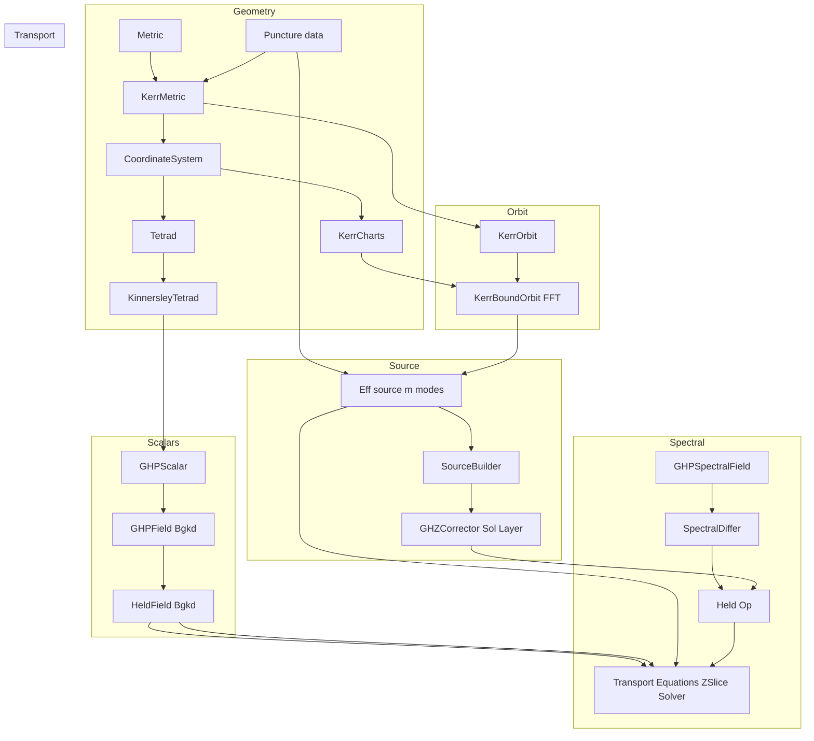
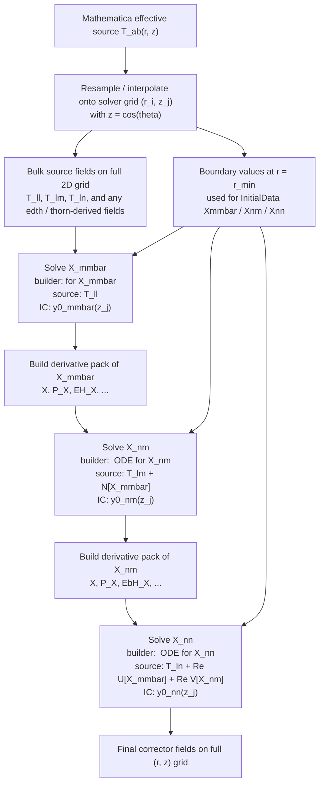

## GHZ_numeric

**Green–Hollands–Zimmerman (GHZ) Transport Solver**

A modular C++ framework for building the numerical infrastructure needed to solve the
**GHZ transport equations** in an $$m$$-mode effective source scheme 
for generic bound orbits in Kerr spacetime.

---

## Overview

`GHZ_numeric` provides reusable components for Kerr geometry and GHP/Held calculus,
together with spectral differentiation tools and transport ODE solvers used in the
GHZ corrector hierarchy.

Core capabilities include:

- **Kerr geometry**
    - Kerr metric functions and invariants
    - Multiple coordinate charts (Boyer–Lindquist, ingoing Kerr, outgoing Kerr)
- **Frames (tetrads)**
    - Construction of null tetrads (e.g. Kinnersley)
    - Consistency checks and tetrad/metric utilities
- **GHP / Held scalars**
    - Type-safe GHP scalars with $$(p,q)$$ weights
    - Held background fields and coefficients
    - NP/GHP quantities and spin coefficients
- **Spectral numerics**
    - Legendre–Gauss–Lobatto (LGL) in $$z=\cos\theta$$, Chebyshev in $$r$$
    - Differentiation matrices, barycentric interpolation, spectral filtering
    - Pole-safe Held operator implementations 
- **Transport solvers**
    - ODE infrastructure for integrating GHZ transport systems along rays ($$z$$-slices)
    - Builder-style operator construction for hierarchy levels

Planned / in-progress modules:
- Importing Teukolsky spectral data from external solvers
- Metric reconstruction utilities

---

## 🧱 Project Structure

The project uses a standard `include/` + `src/` split with a shallow module structure.

```text
include/
  ghz/
    core/        # basic types, utilities
    geom/        # coordinates, metrics, tetrads
    ghp/         # GHP + Held scalars/coefs, NP/GHP quantities
    spectral/    # spectral fields, differentiation, filters, operators
    transport/   # ODE systems, transport solvers, corrector hierarchy tools
    orbit/       # bound orbit parametrizations and frequencies
    source/      # source/effective-source construction utilities

src/
  ghz/
    core/
    geom/
    ghp/
    spectral/
    transport/
    orbit/
    source/

**The codebase is organized into modular namespaces and directories reflecting the core components:**
- *Geometry objects* (metrics, charts, tetrads) live in `geom/`.
- *GHP/Held objects* (weighted scalars, spin coefficients, Weyl scalars) live in `ghp/`.
- *Numerical operators on grids/slices* (LGL/Cheb differ, filters, Held operators) live in `spectral/`.
- *ODE integration and corrector plumbing* lives in `transport/`.
- *Orbit and source models* live in `orbit/` and `source/`.
```

---

## Conceptual Architecture



Each class is independent and documented internally.  
The `main.cpp` file demonstrates how to:
- Construct the Kerr metric.
- Build a tetrad.
- Compute NP and GHP spin coefficients.
- Verify metric–tetrad consistency.

---

# Transport Equation Hierarchy Layering
## 1. Data ingestion layer
- From Mathematica we produce the effective source components $$T^{\mathcal R}_{\mu\nu}$$ on some source grid, then in C++:
  - interpolate/resample onto the solver grid
  - extract the left boundary values at $$r_{min}$$ (say for box windowed puncture)
  - store the  source fields (IRG case) $$T^{\mathcal R}_{ll}$$, 
  - $$T^{\mathcal R}_{lm}$$,
  - $$T^{\mathcal R}_{l\bar m}$$ 
  - $$T^{\mathcal R}_{nn}$$ on the full 2D grid.
## 2. Hierarchical solve layer
- Solve radial ODEs slice-by-slice in $$z$$ (i.e. along rays) for each corrector field, building up the hierarchy level by level.
using ZSliceSolver class member solver_single_z
- Level 1:
  - Solve for $$X_{m\bar m}$$ via ODE with source $$T_{ll}$$ and ICs from left worldtube boundary 
  - Build derivative pack of $$X_{mmbar}$$ using the Held operators (e.g. $$X$$, $$P[X]$$, $$EH[X]$$, etc)
- Level 2:
- Solve for $$X_{mmbar}$$ via ODE with source $$T_{lm} + \mathcal N[X_{m\bar m}]$$ and ICs from left boundary data
  - Build derivative pack of $$X_{nm}$$ for use in the next level
- Level 3:
  - Solve for $$X_{nn}$$ via ODE with source $$T_{ln} + \mathcal U[X_{mmbar}] + \mathcal V[X_{nm}]$$ and ICs from left boundary data
## 3. Final corrector field assembly layer
- Build the residual corrector fields on the full 2D grid by adding the analytically known vacuum region contributions
  (homogeneous solutions with coefficients fixed by the right $$r_{max}$$ worldtube boundary data) 




# Core Components

Below are the main classes and their purposes.

---

# 0. `GHZTypes`
Core type definitions and utilities supporting boost multiprecision, complex numbers, and linear algebra.

## 1. `KerrMetric`
Coordinate-independent Kerr metric object.

- Stores Kerr parameters $$(M, a)$$
- Provides metric functions, $$\Delta, \Sigma, \kappa_\pm, \Omega_\pm$$ etc and conformal parameters 
 as in https://arxiv.org/pdf/1910.13452
- Backend used by all coordinate-specific metrics

---

## 2. `CoordinateHelper`
Constructs quantities in and provides functions to transforms between:

- Boyer–Lindquist coordinates
- Ingoing Kerr coordinates
- Outgoing Kerr coordinates
- Outgoing conformally compactified coordinates

Provides:

- Metric components in each coordinate chart
- Transformations between charts
- Useful geometric quantities for tetrads and scalars
---

## 3. `KinnersleyTetrad<Coordtype T>`
Builds the Kinnersley tetrad and derived bkg quantities in all supported coordinates.

Computes:

- Basis vectors 
- Newman–Penrose spin coefficients
- GHP coefficients
- Weyl scalars
- Held coefficients

---

## 4. `GHPScalar<Complex T>`
Complex scalar with GHP weights $$(p,q)$$ and 
covariant boost/spin transformations.

- Operator overloads: `+, -, *, / with correct GHP transformation behavior
- Type-safe representation of weighted scalars

This is the basic algebraic object used everywhere.

---

## 5.   `FieldVectorized<typename T,size_type dim>`

As base class of `GHPFieldVectorized (base on FieldVectorized<GHPScalar<Complex>,2>)
and HeldFieldVectorized (based on FieldVectorized<GHPScalar<Complex>,1>;)`

GHPFieldVectorized represents a fast vectorized row-major fields of 
Geroch-Held-Penrose (GHP) scalars with spin-boost weights (p,q)
on an $$N_r \times N_z$$   grid of $$r,z$$ values.

- Stored as a 2D grid `[r][z]` or 1d  `[z]` array of GHP/Held scalars with metadata for dimensions
- Arithmetic operator overloads which handle GHP weights 
- accessors and views for slicings in $$r$$ or $$z$$
- lambda functions which fill the values given a function of $$r$$,$$z$$
- GHP covariant tranformations inc. as conjugation and spin-boosts
- Used for background quantities such as GHP spin coefficients 
- Used for spectral field perturbed quantities, e.g. the corrector fields

---

## 6.  Spectral Fields (`ghz/spectral`)
- **`SpectralFieldVectorized<T>`**: generic 2D spectral field container with contiguous storage and fast slice views.
  - stores mode metadata (e.g. $$m$$, $$\omega$$, and/or $$\{m,k_r,k_z\}$$ depending on configuration)
  - provides `RSlice`/`ZSlice` views via `std::span`/raw pointers
  - supports OpenMP-friendly element-wise operations

- **`SpectralGHPVectorized`**: GHP-aware spectral field (combines `GHPFieldVectorized` + `SpectralFieldVectorized`)
  - stores **GHP scalars** with spin/boost weights $$(p,q)$$
  - adds **spectral mode metadata** (e.g. \(m,\omega\) or $$(m,k_r,k_z$$))
  - supports OpenMP element-wise arithmetic and conjugation
  - provides row/column slicing via `std::span` and pointer-backed views
  - uses a fully contiguous memory layout for cache efficiency

## 7. `SpectralDiffer`
Legendre–Gauss–Lobatto collocation, barycentric interpolation and differentiation.
- builds nodes and differentiation matrices for spectral fields

Provides:

- LGL node construction in the z-direction and Chebyshev nodes in the r-direction
-  d/dz via Legendre differentiation matrices
-  d/dr via Chebyshev differentiation matrices
- Barycentric interpolation

Used to operate on `ZSlice` objects of a `SpectralField`.

## 8. `KinnersleyHeldOperators<CoordType T>`
Implements Held operators on spectral field slices
 - used to build the transport operators in the GHZ hierarchy


## 9. `KerrBoundOrbit`
Action–angle parametrization of bound orbits in Kerr spacetime.

- Computes mino and BL frequencies via elliptic integrals
- Decomposes motion into secular and oscillatory pieces 
- Builds Fourier decomposition of phase variables 
- Keplerian parametrization
- Supplies data needed for constructing puncture sources

---

## ⚙️ Build Instructions

### Requirements
- **C++17** or newer (tested with Clang and GCC).
- **CMake ≥ 3.15**.
-  **Boost** for multiprecision, elliptic integral, and linear algebra

### Build

```bash
git clone https://github.com/<yourname>/GHZ_numeric.git
cd GHZ_numeric
mkdir build && cd build
cmake ..
make

