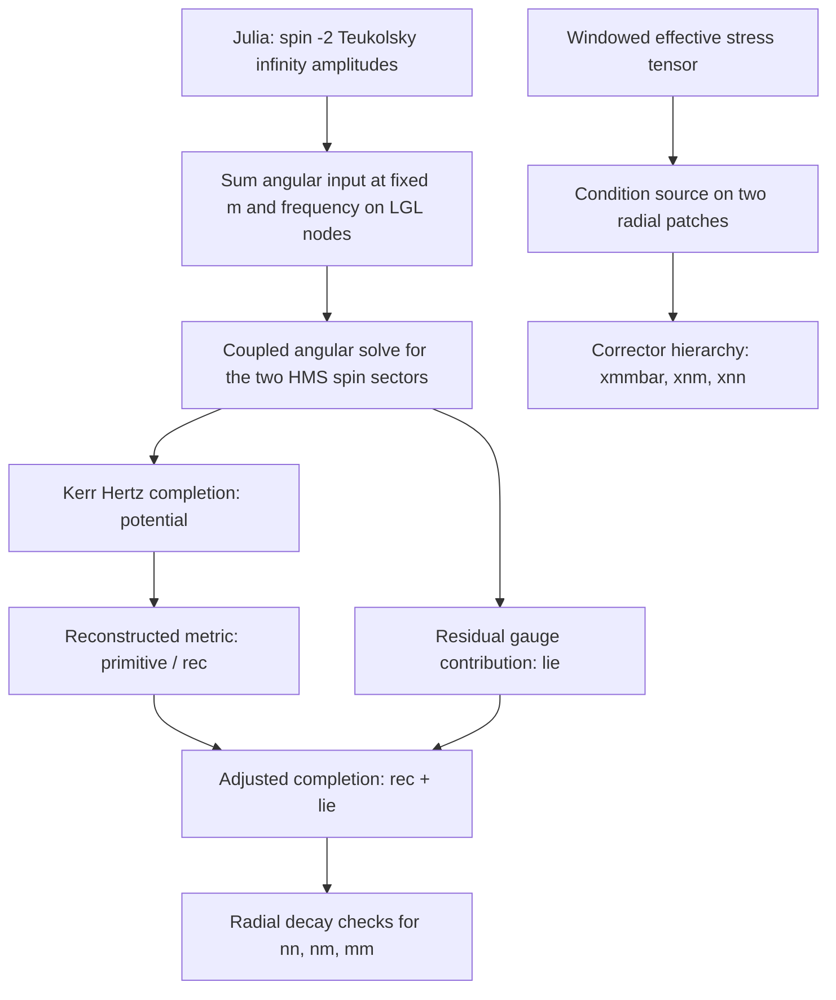

**GHZ_numeric — GHZ transport and Bondi-like metric reconstruction**

Numerical tools for the Green–Hollands–Zimmerman (GHZ) reconstruction scheme in Kerr spacetime. The repository combines C++ geometry, GHP/Held calculus, and spectral solvers with Mathematica puncture/source calculations and Julia Teukolsky input. The implemented Kerr **m-mode completion** constructs the Hertz completion and residual gauge contribution on an angular grid and checks the resulting Bondi-like radial decay.

The [paper-to-code map](Notes/Bondi_GHZ_paper_code_map.md) connects the sections, equations, and figures of *Metric reconstruction in a Bondi-like gauge* to files, classes, and functions. It includes the Kerr m-mode pipeline, the Schwarzschild reference calculations, and the separate GHZ corrector hierarchy. Its equation numbers refer to the draft inspected on 29 September 2026.

**The Kerr m-mode pipeline**


```mermaid
flowchart TD
    J["Julia: spin -2 Teukolsky infinity amplitudes"] --> Q["Sum angular input at fixed m and frequency on LGL nodes"]
    Q --> F["Coupled angular solve for the two HMS spin sectors"]
    F --> P["Kerr Hertz completion: potential"]
    P --> R["Reconstructed metric: primitive / rec"]
    F --> G["Residual gauge contribution: lie"]
    R --> A["Adjusted completion: rec + lie"]
    G --> A
    A --> D["Radial decay checks for nn, nm, mm"]
    T["Windowed effective stress tensor"] --> C["Condition source on two radial patches"]
    C --> X["Corrector hierarchy: xmmbar, xnm, xnn"]
```

[export_gsn_circular_m_mode.jl](scripts/export_gsn_circular_m_mode.jl) obtains separated Teukolsky amplitudes from [GeneralizedSasakiNakamura.jl](https://github.com/ricokaloklo/GeneralizedSasakiNakamura.jl), expands the spheroidal harmonics into spherical coefficients, and exports the summed angular input. The C++ executable [bondi_kerr_m_mode_check.cpp](tools/bondi_kerr_m_mode_check.cpp) evaluates those coefficients on Legendre–Gauss–Lobatto (LGL) nodes. Seed inversion and reconstruction then operate on the summed m-mode fields.

Its `KerrDiagnostic` class implements the nonzero-spin Kerr construction:

- `potential` constructs all four Held Hertz-completion coefficients and their cubic in $\rho^{-1}=-r+iaz$.
- `primitive` and `rec` apply metric reconstruction using spectral angular derivatives and analytic radial derivatives.
- `lie` constructs the residual gauge contribution, including the Kerr Held coefficients $\tau^\circ$ and $\Omega^\circ$.
- The radius loop adds the complex reconstructed and gauge fields before taking norms, then checks $1/r$ decay of the `nn`, `nm`, and `mm` components.

The Julia-driven route solves two coupled fourth-order angular equations using the leading radiative coefficient of $\psi_4$. The direct $\psi^{5\circ}$ route is also implemented by [BondiHeldSeedSolver](include/ghz/asymptotic/BondiHeldSeedSolve.hpp), using the eighth-order angular chain. See the [input and convention notes](Notes/GSN_Bondi_interface.md) for the relation between the two routes.

**Corrector and shared numerical infrastructure**

The sourced corrector is a separate branch. [solve_worldtube_hierarchy](include/ghz/transport/Corrector.hpp) solves $x_{m\bar m}$, $x_{nm}$, and $x_{nn}$ sequentially, using source terms and derivatives from earlier levels. Chebyshev collocation on two radial patches avoids differentiating across the particle's nonsmooth source. The first two equations are second order; the final equation is first order. The inward formulation uses `BCSide::Right` with appropriate outer boundary data; this must be selected explicitly.

| Location | Main contents |
|---|---|
| [geom](include/ghz/geom/) | Kerr parameters, metrics, coordinate charts, and the Kinnersley tetrad. |
| [ghp](include/ghz/ghp/) | Weighted GHP scalars, NP coefficients, and Held background fields. |
| [spectral](include/ghz/spectral/) | LGL and Chebyshev differentiation, interpolation, spectral fields, and pole-factorized Held operators. |
| [asymptotic](include/ghz/asymptotic/) | HMS inversion, Schwarzschild modal/grid completion and gauge references, and partial banded Kerr coefficient-space helpers. |
| [transport](include/ghz/transport/) | Two-domain collocation, hierarchy orchestration, source builders, and the alternative Runge–Kutta framework. |
| [source](include/ghz/source/) | Effective-source archives, interpolation/conditioning, boundary data, angular projection, and spin +2 Teukolsky source assembly. |
| [orbit](include/ghz/orbit/) | Circular and bound Kerr orbits, frequencies, phases, and Fourier ingredients. |
| [tools](tools/) and [scripts](scripts/) | Kerr completion executable, Schwarzschild diagnostic data, Julia exports, and plotting. |
| [MathematicaNotebooks](MathematicaNotebooks/) | Punctures, effective sources, projections, correctors, and reconstruction workflows. |
| [tests](tests/) | Geometry/operator, source, transport, and Bondi checks with reference data. |

C++ declarations generally live in `include/ghz/` and implementations in the matching `src/ghz/` directories. The Kerr m-mode completion currently lives in the diagnostic executable under `tools/`.

**Build and checks**

The current [CMake configuration](CMakeLists.txt) requires CMake 3.20 or newer and C++20, with Eigen3, FFTW3, OpenMP, and Boost headers. It currently hard-codes Homebrew LLVM and dependency paths under `/opt/homebrew`; those settings need adjustment for other toolchains or platforms.

From the repository root, with those dependencies available:

```sh
cmake -S . -B build
cmake --build build -j 4
ctest --test-dir build --output-on-failure
```

For the Kerr completion checks using the committed Julia-exported input tables:

```sh
cmake --build build --target bondi_kerr_m_mode_check -j 4
ctest --test-dir build -R '^bondi_kerr_' --output-on-failure
```

To generate the Kerr radial scan and figure:

```sh
./build/bondi_kerr_m_mode_check Data/gsn_circular_a0.5_m2.csv Data/gsn_kerr_m2_decay_n13.csv 13
python3 scripts/plot_gsn_kerr_decay.py
```

The plotting script requires NumPy and Matplotlib. It writes `plots/gsn_kerr/radial_decay.png` and `.pdf`.

To regenerate the input amplitudes, use a Julia environment containing `GeneralizedSasakiNakamura` and `SpinWeightedSpheroidalHarmonics`:

```sh
julia --startup-file=no -O1 scripts/export_gsn_circular_m_mode.jl 0.5 8
julia --startup-file=no -O1 scripts/export_gsn_circular_m_mode.jl 0.0 8
```

The exporter fixes a circular equatorial orbit with $M=\mu=1$, $r_0=10$, and $m=\pm2$. Its arguments set Kerr spin, the source multipole cutoff, and an optional output path. Julia is only needed to regenerate these inputs, not to run the C++ checks with the committed CSV files.

**Numerical examples and current scope**

The [Kerr decay notes](Notes/GSN_Kerr_m_mode_decay.md) record the circular-orbit checks, the Schwarzschild limit, resolution comparisons, and reproduction commands. [Schwarzschild checks](plots/bondi_schwarzschild/README.md) document the angular seed comparison, modal/grid cancellation, and gauge-vector contraction tests. These checks establish the behavior of the completion and gauge pieces; the gauge-contraction test alone is not a computation of the full Detweiler redshift.

The implemented Kerr Hertz completion includes the full $\rho=-1/(r-iaz)$ dependence. The current executable demonstrates a nonstationary, single-m circular-orbit calculation. It does not assemble the minimal Hertz solution, sourced corrector, and Kerr parameter perturbation into a complete residual metric. Generic bound-orbit geometry and mode metadata are present, while the full generic-orbit puncture/source pipeline and static sector require further work.

The C++ diagnostic uses `rec + lie` and its documented Hertz normalization. The paper draft writes the gauge term with a minus sign, so use the [paper map's convention notes](Notes/Bondi_GHZ_paper_code_map.md) when translating formulas.
